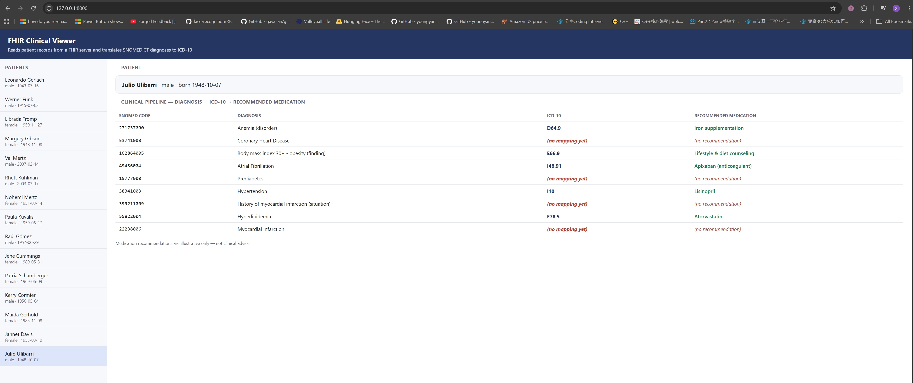

# FHIR Clinical Viewer

A small full-stack app that reads patient clinical data from a FHIR server,
translates SNOMED CT diagnosis codes to ICD-10, and suggests a recommended
medication for each diagnosis — an end-to-end clinical interoperability pipeline.



## Features
- Fetches synthetic patients and their conditions from a live FHIR (R4) server
- Translates each SNOMED CT diagnosis code to ICD-10 at request time
- Maps each ICD-10 code to a recommended medication (ICD-10–keyed medicines list)
- Interactive web UI: select a patient → see the full **Diagnosis → ICD-10 → Medication** pipeline

> Medication recommendations are illustrative only — not clinical advice.

## Tech stack
Python · FastAPI · FHIR (R4) · vanilla-JS frontend

**Data source:** SMART Health IT sandbox (`https://r4.smarthealthit.org`) — synthetic patients.

## How to run
```bash
py -3.11 -m pip install -r requirements.txt
py -3.11 -m uvicorn main:app --reload
# then open http://127.0.0.1:8000/
```
Optional — quick FHIR connection check without the server:
```bash
py -3.11 explore.py
```

## How it works
1. `GET /patients` — fetches patients from the FHIR server.
2. `GET /patients/{id}` — fetches the patient's `Condition` resources (SNOMED-coded), then:
   - **SNOMED CT → ICD-10** via a lookup table, and
   - **ICD-10 → recommended medication** via an ICD-10–keyed table.
3. The frontend (`index.html`) renders the full pipeline for the selected patient.

The mapping tables in `main.py` are small and illustrative; they can be expanded
or replaced with a full crosswalk file.

## Project structure
| File | Purpose |
|------|---------|
| `main.py` | FastAPI backend, mapping tables, and serves the frontend |
| `index.html` | Frontend UI |
| `explore.py` | Standalone script to test the FHIR connection |
| `requirements.txt` | Dependencies |
